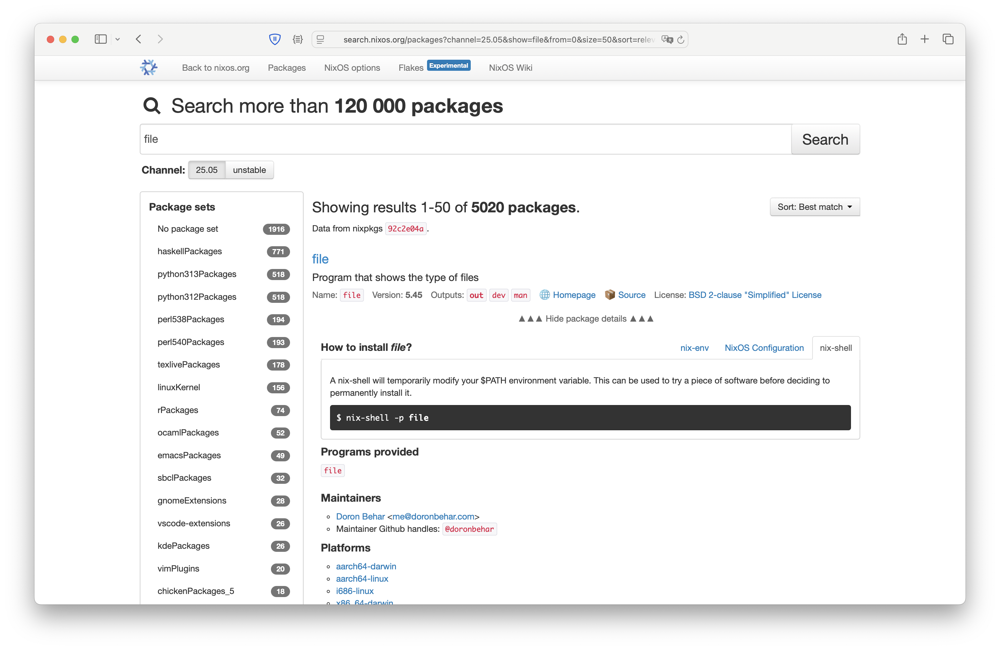
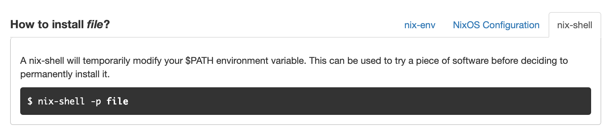

Baue einen plain html prototypen, der grundsätzlich das design von [diesem Beispiel](layout.png) übernimmt.

Der Fokus soll dann [auf diesem Bereich](fokus.png) liegen, den ich überarbeiten möchte.

Wenn möglich bitte alles in einer datei, mit allen abhängigkeiten von einem CDN, ohne irgend etwas zu installieren, damit die Datei einfach als Demo verschickbar ist.

Die Umsetzung soll mit plain html mit tailwind erfolgen. Erstelle alles in der datei index.html
